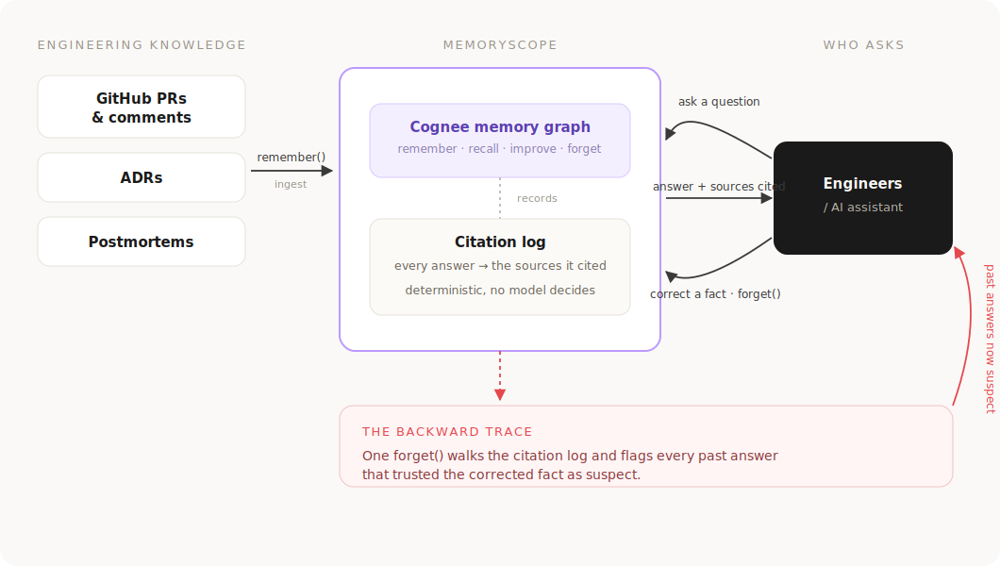
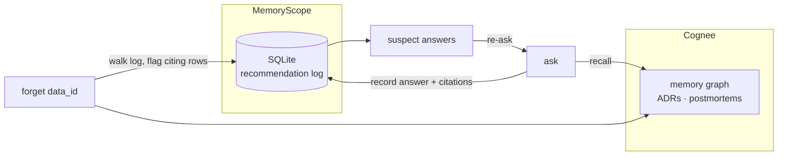

# MemoryScope - The Hangover Part AI (Cognee x WeMakeDevs)


*Yesterday's truth should stop influencing today's decisions.*

MemoryScope is an observability and correctness tool built on top of [Cognee](https://github.com/topoteretes/cognee). A backward-trace tool for AI memory: when a remembered fact gets corrected via `forget()`, MemoryScope flags every past recommendation that relied on the now-invalidated fact as suspect.

## Where MemoryScope fits



## Who it's for

Engineering teams giving their AI assistants persistent memory of ADRs,
postmortems, and incident history. When a past decision is superseded, that
memory quietly keeps recommending the old answer. MemoryScope is for the
person who needs to know **which past answers a correction just invalidated**:
platform and infra engineers, on-call responders, and anyone maintaining an
AI agent that remembers more than it should.

## Why

AI Coding assistants with persistent memory of past incidents and decisions will
keep recommending based on an assumption even after that assumption is
found wrong. Nothing currently tracks which past outputs are now suspect
once the underlying fact changes. The same idea as (`npm audit`) applied to AI memory.

## How it works

1. Ingest postmortems, ADRs, or decision docs from a GitHub repo (issues,
   PR discussions, markdown files) into Cognee.
2. Ask a question. The answer is logged along with which memory it cited.
3. When the cited fact is corrected (`forget()` the old version,
   `remember()` the new one), MemoryScope flags the earlier answer as
   suspect.
4. Re-asking the same question returns the corrected answer.

## Architecture

Cognee holds the memory graph. MemoryScope adds an external SQLite
**recommendation log** that records every answer with the `chunk_id` /
`data_id` it cited. `forget()` walks that log and deterministically flags
dependents. No model decides what is suspect.



## What Cognee provides vs what MemoryScope adds

| Cognee (out of the box) | MemoryScope (this project) |
|---|---|
| Store / recall / improve / forget over a memory graph | A **recommendation log** of every answer + its citations |
| Semantic retrieval, graph completion | **Blast radius**: how many past answers a `forget()` invalidates |
| Graph of entities and documents | **Suspect flagging**, computed from the log, not an LLM verdict |
| | Re-ask a suspect answer to get the corrected one |

The suspect flag cannot hallucinate, because no model produces it: it is a
join between the SQLite citation log and a `forget()` event.

## Docs

- [Plan](docs/PLAN.md)
- [Cognee API notes from first iteration local setup](docs/cognee-api-notes.md)

## Setup

```bash
python -m venv venv && source venv/bin/activate
pip install -r requirements.txt
cp .env.example .env  # fill in LLM_API_KEY, run Ollama locally with nomic-embed-text pulled
uvicorn backend.app:app --reload
```

```bash
cd frontend
npm install
npm run dev
```

## Seed & demo

Populate the graph with the 8 ADR/postmortem seed docs (auth: session → JWT →
OAuth; DB: connection-per-request → PgBouncer). Run with the API server
**stopped**. Cognee's graph store is single-writer.

```bash
python scripts/seed.py
```

Walkthrough once seeded:

1. **Ask** a question (e.g. *"How should we authenticate the mobile app?"*).
   The answer shows the sources it cited underneath.
2. Ask a couple more that lean on the same auth docs.
3. **Lifecycle** → `forget()` the session-auth ADR. The confirm dialog shows
   the **blast radius**: how many past answers this invalidates.
4. Back on **Ask**, those answers now read **suspect**. Re-ask one to get the
   corrected answer; the old row stays flagged.
5. **Memory Graph** highlights the forgotten source's dependents.

## Known limitations

- **Citations are a CHUNKS approximation.** Cognee's graph-completion answer
  doesn't expose which nodes it used, so citations come from a parallel
  vector (CHUNKS) recall over the same question. Honest and deterministic,
  but not a guaranteed 1:1 with the graph answer's provenance.
- **Time-travel (`as_of`) filters by ingest time**, not by the historical
  dates written inside the seed docs; all seed docs share one ingest run.

## Credits

- Built by [Harshitha Sompura](https://github.com/harshithasompura).
- Memory layer powered by [Cognee](https://www.cognee.ai).
- Built for the [WeMakeDevs](https://www.wemakedevs.org/) × Cognee hackathon.
- Developed with [Claude Code](https://claude.com/claude-code) (Anthropic) as
  the coding assistant. The reasoning at runtime uses Anthropic's Claude models
  for recall and contradiction detection.
